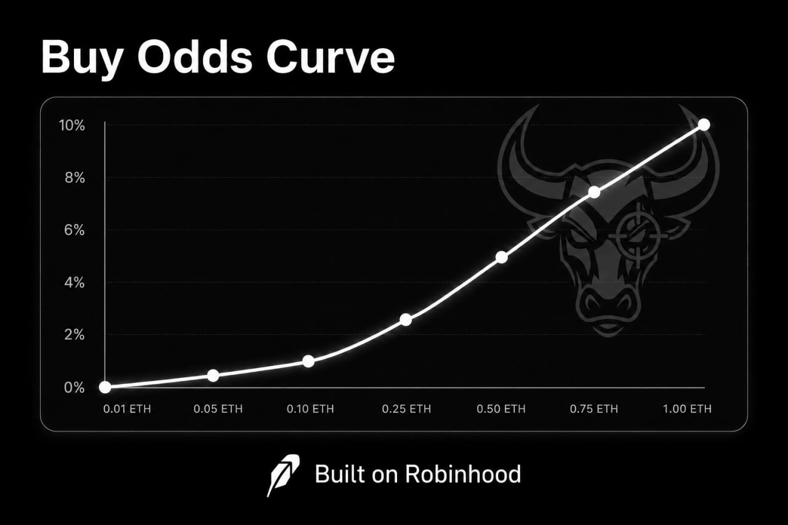

Bulls Eye is a buy-to-play jackpot token.

## The loop

1. A user buys `BEYE`.
2. If the buy clears the minimum size, it qualifies for a shot.
3. The buy gets a jackpot chance based on the native ETH value of that buy.
4. Chainlink VRF resolves the draw.
5. If the buy wins, native ETH is sent to that buyer wallet.
6. If the buy misses, that draw is over and the next shot requires another buy.

## What counts as a shot

- Only buys can trigger the jackpot
- Sells pay tax but do not get a draw
- The qualifying floor starts at `0.01 ETH`

## Why the pot does not instantly die

- The public jackpot is always `50%` of the available vault
- That means there is always something left behind after a win
- The game can keep running without the vault going to zero every time somebody nails a shot

## Buy size matters

Bulls Eye is built for conviction. Small buys can still play, but bigger buys get heavier odds.

| Buy amount | Chance to win |
| ---------: | ------------: |
| `0.01 ETH` |        `0.10%` |
| `0.05 ETH` |        `0.50%` |
| `0.10 ETH` |        `1.00%` |
| `0.25 ETH` |        `2.50%` |
| `0.50 ETH` |        `5.00%` |
| `0.75 ETH` |        `7.50%` |
| `1.00 ETH+` |      `10.00%` max |

- Buys below `0.01 ETH` do not get a draw
- Odds scale with the native ETH value of the buy, not the number of tokens received
- Anything above `1 ETH` stays capped at `10%`

## Taxes

- Buy tax: `5%` total
- Sell tax: `5%`
- Current buy split: `4%` jackpot funding and `1%` vault funding

## Early access round

- Early access is separate from the live jackpot token flow
- Wallets contribute native ETH into the early access contract while the round is open
- After it closes, the final `BEYE` claim pool is funded
- Contributors claim their pro-rata share based on how much ETH they put in

## What people can verify

- The qualifying buy
- The draw result
- The winner payout
- The live jackpot state

If the bot says somebody won, the chain should back it up.
