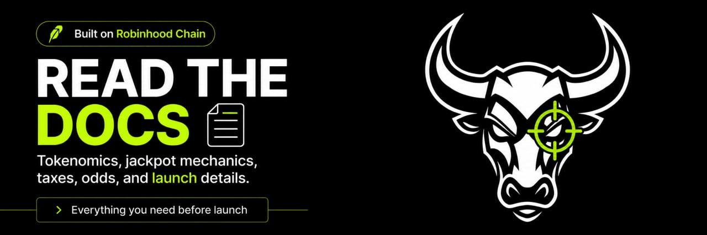

Bulls Eye is simple on purpose.

Buy a minimum of `0.01 ETH` worth of `$BEYE` for a chance to win the jackpot. Buy more to increase your odds, and if you hit, the ETH prize is automatically sent directly to your wallet. 🎯

## The pitch

- Every qualified buy is its own draw
- Bigger buys get bigger odds
- Winners get paid in native ETH
- Only half the vault is live as jackpot, so there is always ammo left
- The whole thing can be checked on-chain

## At a glance

- Name: `Bulls Eye`
- Ticker: `BEYE`
- Total supply: `1,000,000,000`
- Buy tax: `5%`
- Sell tax: `5%`
- Qualifying buy floor: starts at `0.01 ETH`
- Max launch odds: `10%` at `1 ETH`

## You Have to Play to Win.

## What to read next

- [How It Works](./how-it-works)
- [Tokenomics](./tokenomics)
- [Telegram](./telegram)
- [FAQ](./faq)
