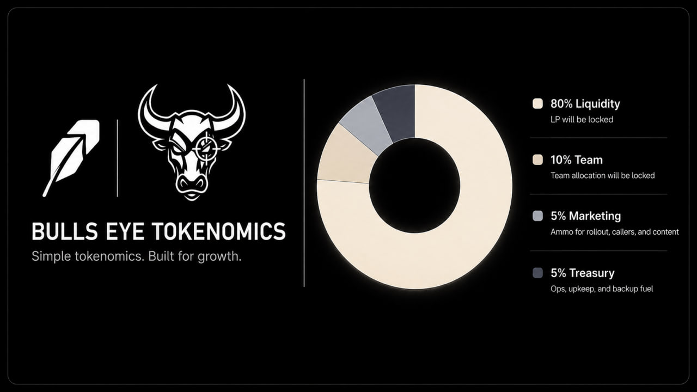

Bulls Eye keeps the setup tight. No bloated split. No mystery buckets.

## Identity

- Name: `Bulls Eye`
- Ticker: `BEYE`
- Total supply: `1,000,000,000`

## Allocation

- `65%` launch liquidity
- `15%` early access pool
- `10%` team allocation
- `5%` marketing
- `5%` treasury

The pie chart shows the full starting supply split.

The `15%` early access pool is there to help seed launch liquidity, support rollout, and onboard aligned early supporters and KOLs before public trading opens.

## Launch policy

- LP will be locked for `3 months`
- After a successful launch, the LP will be burned forever
- Team allocation will be locked

## Taxes

- Buy tax: `5%`
- Sell tax: `5%`

Both sides feed the jackpot flow and the rewards vault flow. Only qualifying buys can roll for the jackpot.

## Early access

- Early access is an open contribution round
- Contributors send native ETH while the round is open
- After the round closes, the final `BEYE` pool is set
- Claims are paid pro-rata based on each wallet's share of the total ETH raised
- The ETH raised helps seed LP, support marketing, and bring in early KOL coverage

## Buy odds

- Minimum qualifying buy starts at `0.01` native ETH equivalent
- Odds are based on the native ETH value of the buy
- The curve tops out at `1 ETH = 10%`

## Jackpot policy

- Only qualifying buys trigger jackpot entries
- Every eligible buy is resolved through Chainlink VRF
- Winners are paid in native ETH
- The jackpot is always half of the available vault balance
