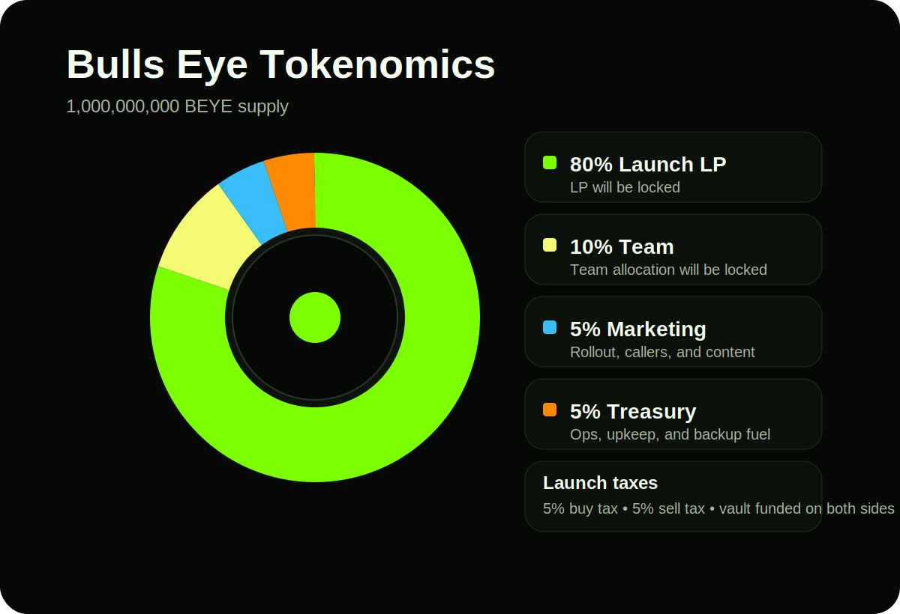
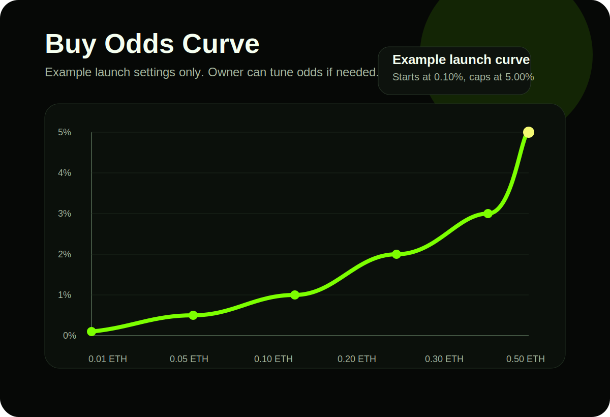

Bulls Eye keeps the setup tight. No bloated split. No mystery buckets.

## Identity

- Name: `Bulls Eye`
- Ticker: `BEYE`
- Total supply: `1,000,000,000`

## Allocation

- `80%` liquidity allocation
- `10%` team allocation
- `5%` marketing
- `5%` treasury

The pie chart shows the full starting supply split at launch.

## Launch policy

- LP will be locked for `3 months`
- After a successful launch, the LP will be burned forever
- Team allocation will be locked

## Taxes

- Buy tax: `5%`
- Buy split: `4%` jackpot and `1%` vault
- Sell tax: `5%`

## Buy odds

- Minimum qualifying buy starts at `0.01` native ETH equivalent
- Odds are based on the native ETH value of the buy
- The curve tops out at `1 ETH = 10%`

## Jackpot policy

- Only qualifying buys trigger jackpot entries
- Every eligible buy is resolved through Chainlink VRF
- Winners are paid in native ETH
- The jackpot is always half of the available vault balance
