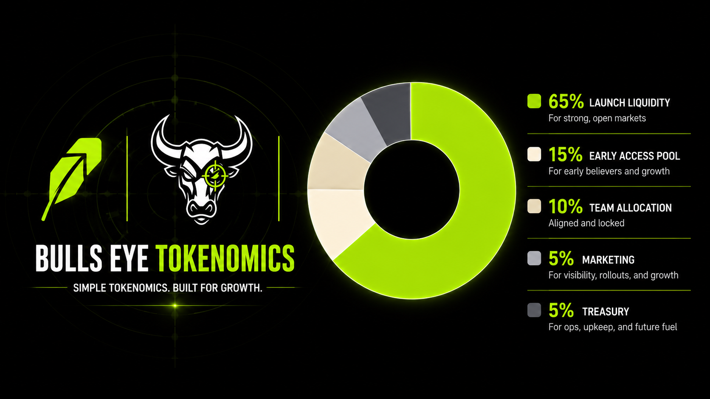

Bulls Eye keeps the setup tight. No bloated split. No mystery buckets.

## Supply

`1,000,000,000 BEYE`

## Allocation

- `65%` launch liquidity
- `15%` early access pool
- `10%` team allocation
- `5%` marketing
- `5%` treasury

The `15%` early access pool is there to help seed LP, support rollout, and onboard aligned early size before public trading opens.

## Launch policy

- LP will be locked for `3 months`
- After a successful launch, the LP will be burned forever
- Team allocation will be locked

## Taxes

- Buy tax: `5%`
- Sell tax: `5%`

Both sides feed the jackpot flow and the rewards vault flow. Only qualifying buys can roll for the jackpot.
